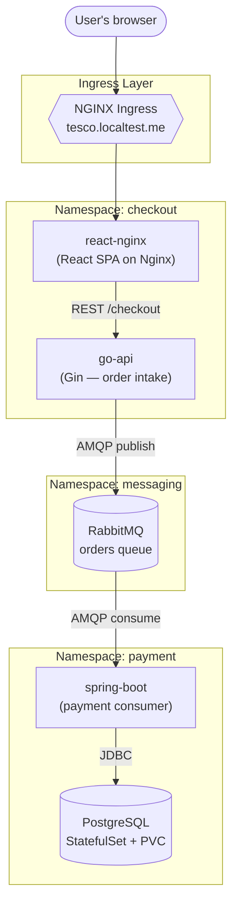
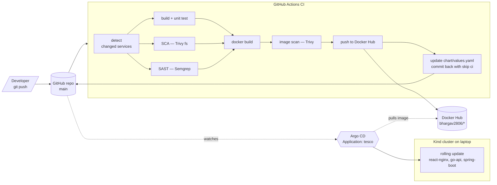
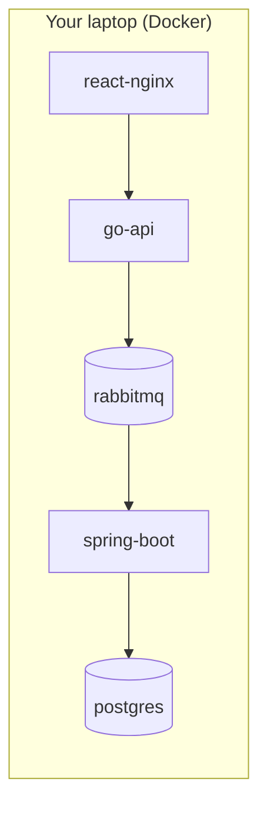
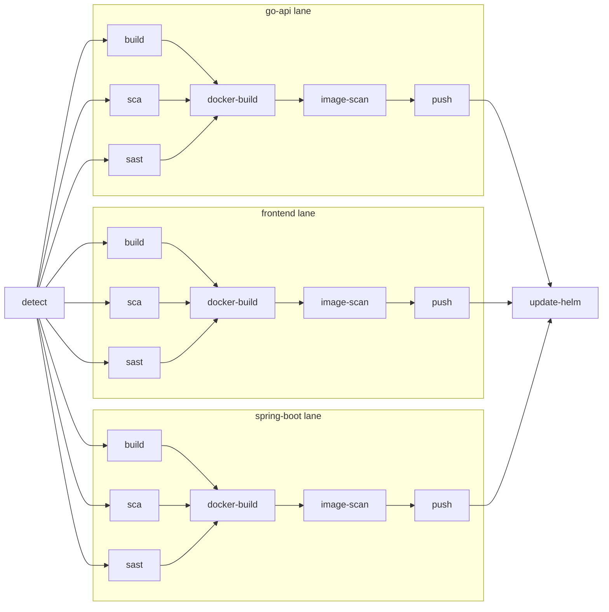

# Tesco Coffee Checkout — End-to-End DevSecOps Project

A full checkout flow for a Tesco-style coffee ordering site, built from zero to practice the complete modern DevOps stack end-to-end:

**Docker Compose → Docker Hub → Kubernetes (Kind) → Helm → Argo CD (GitOps) → GitHub Actions CI/CD with security scanning**

Every phase adds one layer on top of the previous, so you can follow the evolution from a laptop-only dev setup into a fully automated GitOps loop where a `git push` rebuilds, scans, and rolls out new versions to the cluster on its own.

---

## Tech Stack

| Layer | Technology |
|---|---|
| Frontend | React served by Nginx |
| Checkout API | Go (Gin) |
| Payment service | Spring Boot (Java) |
| Message queue | RabbitMQ |
| Database | PostgreSQL |
| Containers | Docker |
| Orchestration | Kubernetes (Kind — local cluster) |
| Packaging | Helm |
| GitOps | Argo CD |
| CI/CD | GitHub Actions |
| SCA + image scanning | Trivy |
| SAST | Semgrep |
| Registry | Docker Hub |

---

## Runtime Architecture

How a checkout request flows through the running system:



Cross-namespace DNS is used to let services find each other — Spring Boot reaches RabbitMQ at `rabbitmq.messaging`, and the Go API does the same. Credentials live in Secrets that are copied into every namespace that needs them.

---

## GitOps + CI/CD Loop

How a code change makes its way from your editor to the cluster:



Push code → pipeline builds & scans & pushes images → the same pipeline bumps the image tag in `chart/values.yaml` → Argo CD sees the new commit → Argo CD re-renders the Helm chart and rolls out the new pods. No manual `kubectl apply` anywhere in the loop.

---

## Project Phases

Six phases, each one adding the next production concern on top of what already works.

### Phase 1 — Docker Compose (local development)

All five services wired together with a single `docker-compose.yml`. One command, whole stack:



Useful for local dev, not production-representative — no orchestration, no HA, no declarative config.

### Phase 2 — Docker Hub

The three custom images (`tesco-react-nginx`, `tesco-go-api`, `tesco-payment-service`) were tagged and pushed under `bhargav2806/*`. This is the handoff from *building* to *running*: now any cluster anywhere can pull and run the same image.

### Phase 3 — Kubernetes on Kind

Compose services reimplemented as Kubernetes manifests and deployed into a local Kind cluster. This is where the real Kubernetes primitives show up:

- **Deployments** for stateless services (react-nginx, go-api, spring-boot, rabbitmq)
- **StatefulSet + PVC** for Postgres — data survives pod restarts
- **Services** for in-cluster DNS
- **Secrets + ConfigMap** for credentials and Postgres init SQL
- **Ingress** as a single entry point at `tesco.localtest.me`
- **Namespaces** (`checkout`, `messaging`, `payment`) for separation of concerns

### Phase 4 — Helm chart

All of Phase 3's raw manifests got templated into a single Helm chart under `chart/`. Image repos, tags, credentials, storage sizes, and the ingress host are all parameterised in `values.yaml`, so the same chart can be deployed with different settings per environment.

### Phase 5 — Argo CD (GitOps)

A single `Application` resource in `argocd/application.yaml` tells Argo CD: *watch this Git repo, render the Helm chart at `chart/`, and make the cluster match it.* Auto-sync, self-heal, and prune are all enabled:

- **auto-sync** — new commits roll out automatically
- **self-heal** — manual `kubectl edit` is reverted
- **prune** — anything removed from Git is removed from the cluster

From here on, Git is the source of truth, not the cluster.

### Phase 6 — GitHub Actions CI/CD (7 stages × 3 services)

A fully split pipeline where every stage is its own visual node. `dorny/paths-filter` means a change to one service's folder only rebuilds that service; a `workflow_dispatch` trigger lets you force a full rebuild manually.

Per-service stages:

1. **Build + Unit Test** — `go test` / `npm test` / `mvn test`
2. **SCA** — Trivy scans source dependencies for CVEs (report-only)
3. **SAST** — Semgrep scans source code for bug patterns (report-only)
4. **Docker Build** — builds the image, saves as tarball artifact, passes to next stages
5. **Image Scan** — Trivy scans the built image (report-only)
6. **Push** — pushes to Docker Hub as `v${{ github.run_number }}` (`v1`, `v2`, `v3`…)

Then, once across all three services:

7. **Update Helm** — `yq` rewrites the three image tags in `chart/values.yaml` and commits back with `[skip ci]` so the update commit doesn't re-trigger the workflow.

Visual graph (20 jobs total):



---

## Repository Layout

```
.
├── frontend/                       Phase 1 — React app + Dockerfile (nginx)
├── go-api/                         Phase 1 — Go/Gin checkout service
├── payment-service/                Phase 1 — Spring Boot payment consumer
├── docker-compose.yml              Phase 1 — local dev stack
├── chart/                          Phase 4/5 — Helm chart
│   ├── Chart.yaml
│   ├── values.yaml                 CI rewrites image tags here
│   └── templates/
│       ├── checkout/               go-api, react-nginx, rmq client secret
│       ├── messaging/              rabbitmq deploy + credentials secret
│       ├── payment/                postgres sts, spring-boot, secrets, init sql
│       └── ingress.yaml            tesco.localtest.me → react-nginx
├── argocd/                         Phase 5 — GitOps config
│   ├── application.yaml            single Application managing the whole stack
│   └── repo-secret.yaml            gitignored — contains GitHub PAT
└── .github/workflows/
    └── ci.yml                      Phase 6 — 20-job pipeline
```

---

## Running It Locally

Prerequisites: Docker Desktop, `kubectl`, `kind`, `helm`, `argocd` CLI.

```bash
# 1. Create a local cluster
kind create cluster --name tesco

# 2. Install NGINX Ingress
kubectl apply -f https://raw.githubusercontent.com/kubernetes/ingress-nginx/main/deploy/static/provider/kind/deploy.yaml

# 3. Install Argo CD
kubectl create namespace argocd
kubectl apply -n argocd -f https://raw.githubusercontent.com/argoproj/argo-cd/stable/manifests/install.yaml

# 4. Add the repo credential (if your repo is private)
kubectl apply -f argocd/repo-secret.yaml

# 5. Create the Application — this deploys the whole stack
kubectl apply -f argocd/application.yaml

# 6. Open the app
open http://tesco.localtest.me
```

From this point on, any push to `main` that changes service code triggers CI, which builds + scans + pushes new images and bumps the tags in `values.yaml`. Argo CD will auto-sync the new version to the cluster within a minute.

---

## What's Running After a Full Deploy

After Argo CD syncs, you'll see roughly this in the cluster:

| Namespace | Workload | Kind | Purpose |
|---|---|---|---|
| `checkout` | `react-nginx` | Deployment | React SPA on Nginx |
| `checkout` | `go-api` | Deployment | Gin order-intake service |
| `checkout` | `rabbitmq-client-credentials` | Secret | AMQP creds for go-api |
| `messaging` | `rabbitmq` | Deployment | Message broker (public image) |
| `messaging` | `rabbitmq-credentials` | Secret | Broker admin creds |
| `payment` | `spring-boot` | Deployment | Payment consumer |
| `payment` | `postgres` | StatefulSet | Postgres with PVC |
| `payment` | `postgres-init-sql` | ConfigMap | schema bootstrap |
| `payment` | `postgres-credentials` | Secret | DB creds |
| `payment` | `rabbitmq-client-credentials` | Secret | AMQP creds for spring-boot |
| `default` | `tesco-ingress` | Ingress | `tesco.localtest.me` → react-nginx |

---

## Lessons Learned Along the Way

The things that actually tripped me up and are worth remembering:

**Env var ordering inside Kubernetes `env:`.** `$(VAR)` substitution only works if the referenced variable is declared *earlier* in the same `env:` list. The Go API deploy declares `RABBIT_USER` and `RABBIT_PASS` before `RABBITMQ_URL` for this exact reason.

**Cross-namespace DNS.** Services in other namespaces are addressed as `<service>.<namespace>` — Spring Boot reaches RabbitMQ via `rabbitmq.messaging`, not just `rabbitmq`.

**StatefulSet drift in Argo CD.** Postgres's StatefulSet can show `OutOfSync` even when the pod is Healthy, because Kubernetes adds server-side defaults (like `volumeMode: Filesystem`) to the PVC template that aren't in Git. Either add `ignoreDifferences` on `/spec/volumeClaimTemplates` in the Application, or do a one-time `kubectl delete sts postgres --cascade=orphan` + sync.

**Pod age is not pod health.** After a CI roll-out, your three app pods (go-api, react-nginx, spring-boot) are minutes old while RabbitMQ and Postgres are hours or days old. That's the right behaviour — CI only rebuilds images for code you own, so infrastructure pods keep running. Long uptime on stateful pods is a feature, not stale junk.

**`revisionHistoryLimit` controls leftover ReplicaSets.** After a few rollouts, each Deployment accumulates old ReplicaSets with zero pods — just rollback history. Harmless, but if you don't want them cluttering the Argo CD tree, set `revisionHistoryLimit: 1` on each Deployment.

**`[skip ci]` in the auto-commit.** The `update-helm` job writes back to the repo. Without the `[skip ci]` marker in the commit message, that write would re-trigger the pipeline and loop forever.

**Paths filter + workflow edits.** `dorny/paths-filter` gates service builds on folder changes. If you only edit `.github/workflows/ci.yml`, no service folder changed and nothing will build. Fix: include the workflow file itself inside each filter's path list, and add `workflow_dispatch:` so you can always force a full rebuild from the Actions UI.

**Private repos + Argo CD.** For a private GitHub repo, Argo CD needs a Secret labelled `argocd.argoproj.io/secret-type: repository` containing a PAT. Without it, every Application will show "repository not accessible".

**Argo CD is a controller, not a runtime.** Stopping Argo CD does *not* stop your running pods — kubelet keeps them alive. Argo CD only compares Git vs cluster and reconciles the difference.

---

## Where This Could Go Next

Ideas to keep practising on top of this:

- Replace hard-coded `Secret`s with **Sealed Secrets** or **External Secrets** so the repo can be public
- Split into an **app-of-apps** Argo CD pattern (infra vs apps)
- Add **Prometheus + Grafana** for metrics and **Loki** for logs
- Move off Kind onto **EKS / GKE / AKS** with real managed Postgres
- Add **integration tests** exercising go-api → rabbitmq → spring-boot inside CI
- Promote the same commit across `dev → staging → prod` clusters using Argo CD `ApplicationSet`
- Gate merges on a **PR preview environment** spun up with `kind` in CI

---

Built as a learning exercise to go from a blank folder to a fully automated CI/CD + GitOps loop. If you're going through this yourself, build it in the order the phases are listed — each phase only really makes sense once you've felt the pain the next one solves.
